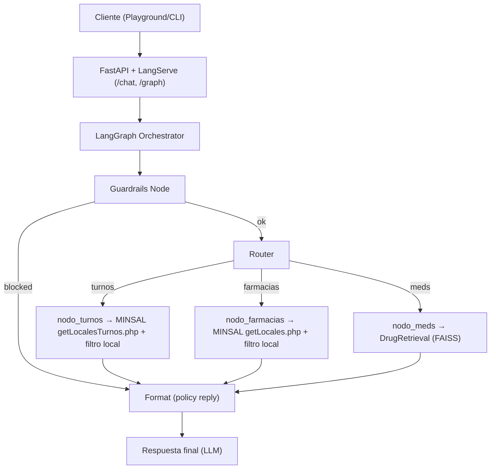
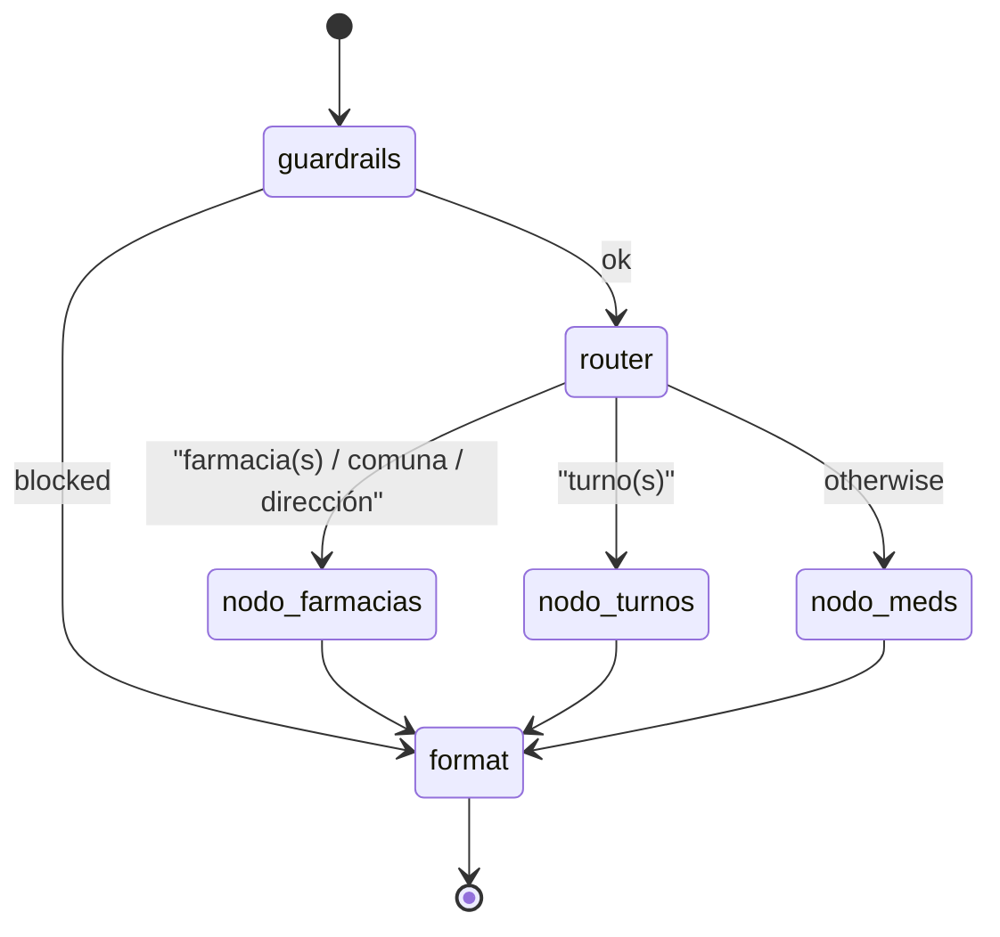
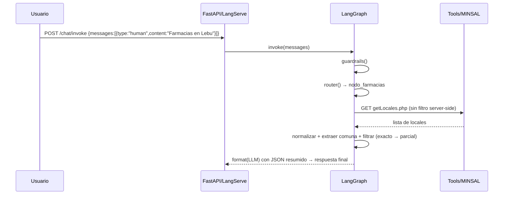

# 🩺 Agente MINSAL + Vademécum (LangGraph)

Este módulo implementa un agente que:
- Consulta farmacias (generales y de turno) desde las APIs públicas del MINSAL.
- Realiza búsqueda semántica sobre un CSV local de medicamentos (`DrugData.csv`).
- Orquesta el flujo con LangGraph (guardrails → router → tools → formato final), exponiendo la API con FastAPI + LangServe.

## 🚀 Inicio rápido

1) Activar entorno y dependencias
```bash
source /Users/pablolastrabachmann/DiploGenAI/venv_diplo/bin/activate
pip install -r /Users/pablolastrabachmann/DiploGenAI/final_proyect/requirements.txt
```

2) Variables de entorno (.env soportado)
- Obligatoria: `OPENAI_API_KEY` (también se acepta `openai_api_key` en minúsculas).
- Opcionales:
  - `DRUGS_CSV_PATH` (default: `final_proyect/drug_dataset/DrugData.csv`)
  - `MINSAL_GET_LOCALES` (default oficial)
  - `MINSAL_GET_TURNOS` (default oficial)
  - `INDEX_DIR` (default: `final_proyect/med_agent_index`)

3) Levantar servidor
```bash
uvicorn final_proyect.med_agent.server:app --host 0.0.0.0 --port 8000 --reload
```

4) Probar endpoints
- Documentación: `http://127.0.0.1:8000/docs`
- Playground LangServe: `http://127.0.0.1:8000/chat/playground/`
- Invocación REST (ojo con el esquema de mensajes):
```bash
curl -X POST http://127.0.0.1:8000/chat/invoke \
  -H 'Content-Type: application/json' \
  -d '{"input":{"messages":[{"type":"human","content":"Farmacias en Ñuñoa"}]}}'
```

---

## 🧭 Arquitectura (alto nivel)



- `server.py`: publica el grafo en `/chat` y `/graph`.
- `graph.py`: define nodos, aristas y decisiones.
- `tools.py`: tools HTTP contra MINSAL.
- `retrieval.py`: índice FAISS sobre `DrugData.csv` con `OpenAIEmbeddings`.

---

## 🧩 Diseño del grafo (LangGraph)



### Nodos clave
- **guardrails_node**: bloquea solicitudes de prescripción/dosis (p. ej., “qué debo tomar”, “dosificación para…”). Si bloquea, produce respuesta de política.
- **router_node**: enruta según intención del usuario:
  - Contiene “turno/turnos” → `nodo_turnos`.
  - Contiene “farmacia/farmacias/comuna/dirección” → `nodo_farmacias`.
  - Caso contrario → `nodo_meds`.
- **nodo_turnos**: llama a `getLocalesTurnos.php`, normaliza y aplica filtro local por comuna (ver más abajo) y entrega un JSON truncado (para no saturar prompts) a `format`.
- **nodo_farmacias**: llama a `getLocales.php`, y aplica el mismo pipeline de normalización/filtros (incluye búsqueda por dirección).
- **nodo_meds**: usa `DrugRetrieval` (FAISS) sobre `DrugData.csv` para obtener top-k medicamentos relevantes.
- **format_final**: compone prompt de sistema (sin recomendaciones médicas, factual, cita fuente) + mensajes previos (con `RESULTADOS_*`) y genera la respuesta final con `ChatOpenAI`.

---

## 🔎 Cómo se extrae y filtra la comuna/dirección

1) Normalización de texto de usuario y campos MINSAL
```mermaid
flowchart LR
  A["Texto usuario"] --> B["lowercase"]
  B --> C["remove accents"]
  C --> D["remove punctuation"]
  D --> E["collapse spaces"]
  E --> F{Pattern?}
  F -->|"en …"| G["extract comuna"]
  F -->|"comuna de …"| G
  F -->|"farmacias de …"| G
  E --> H{Address? (digits/keywords)}
  H -->|sí| I["tokenizar dirección"]
  I --> J["match tokens en local_direccion"]
```

2) Patrones soportados para comuna
- `en <comuna> [hoy|ahora|…]`
- `en la comuna de <comuna>`
- `farmacia(s) de <comuna>`

3) Filtro local robusto (porque el endpoint a veces no filtra server-side)
- Match exacto por comuna normalizada.
- Fallback por coincidencia parcial.

4) Consulta por dirección (ej.: “Libertador Bernardo O’Higgins 779”)
- Detecta presencia de números o keywords (libertador/ohiggins/avenida/calle…).
- Tokeniza y normaliza dirección de la consulta.
- Filtra `local_direccion` que contenga todos los tokens relevantes.

---

## 🌐 Cómo consulta a MINSAL y procesa resultados

- Llamadas HTTP (GET) vía `tools.py`:
  - `tool_minsal_locales` → `MINSAL_GET_LOCALES`
  - `tool_minsal_turnos` → `MINSAL_GET_TURNOS`
- Se parsea la respuesta JSON. Si el servidor no aplica filtro por `comuna`, el agente descarga la lista y aplica el filtrado local (comuna exacta o parcial; dirección si corresponde).
- El resultado filtrado se adjunta como mensaje `RESULTADOS_FARMACIAS` o `RESULTADOS_TURNOS` (JSON truncado para no exceder tokens).
- `format_final` resume y cita fuente (MINSAL) sin hacer recomendaciones médicas.



---

## 💊 Búsqueda semántica en CSV de medicamentos

- `retrieval.py` crea/carga un índice FAISS en `INDEX_DIR`.
- Embeddings con `OpenAIEmbeddings`.
- Cada fila del CSV se transforma en un `Document` con `page_content` que combina campos clave (Drug Name, Generic Name, Indications, Side Effects…).
- `nodo_meds` invoca `retriever.search(query, k=5)` y entrega top-k al nodo `format` para generar una respuesta factual.

---

## 🧪 Ejemplos de uso

- Farmacias en una comuna
```bash
curl -s -X POST http://127.0.0.1:8000/chat/invoke \
  -H 'Content-Type: application/json' \
  -d '{"input":{"messages":[{"type":"human","content":"me puedes listar las farmacias de lebu?"}]}}'
```

- Farmacias de turno
```bash
curl -s -X POST http://127.0.0.1:8000/chat/invoke \
  -H 'Content-Type: application/json' \
  -d '{"input":{"messages":[{"type":"human","content":"que farmacia hay de turno hoy en traiguen?"}]}}'
```

- Buscar por dirección
```bash
curl -s -X POST http://127.0.0.1:8000/chat/invoke \
  -H 'Content-Type: application/json' \
  -d '{"input":{"messages":[{"type":"human","content":"como se llama la farmacia que queda en Libertador Bernardo O\'Higgins 779?"}]}}'
```

- Información de medicamentos
```bash
curl -s -X POST http://127.0.0.1:8000/chat/invoke \
  -H 'Content-Type: application/json' \
  -d '{"input":{"messages":[{"type":"human","content":"efectos adversos del ibuprofeno"}]}}'
```

---

## 🔒 Guardrails (seguridad)
- Políticas de no respuesta: el agente no entrega recomendaciones médicas ni dosificaciones. Ante ese tipo de preguntas, responde con un mensaje de política y fuentes informativas.
- Implementado en `guardrails_node` con detección básica de términos prohibidos; se puede endurecer con clasificadores dedicados.

---

## 🛠️ Estructura de archivos
```
final_proyect/med_agent/
├── __init__.py
├── config.py           # Config y rutas
├── tools.py            # HTTP tools MINSAL
├── retrieval.py        # FAISS + embeddings sobre CSV
├── graph.py            # Grafo LangGraph (nodos y flujo)
├── server.py           # FastAPI + LangServe
└── README.md           # Este documento
```

---

## 🧰 Troubleshooting
- El playground muestra 500 si el JSON de entrada no usa `{type:"human"}` en cada mensaje.
- “Address already in use”: el puerto 8000 está ocupado. Liberar y reiniciar:
```bash
lsof -ti :8000 | xargs -r kill -9
uvicorn final_proyect.med_agent.server:app --host 0.0.0.0 --port 8000 --reload
```
- Clave OpenAI: asegúrate de tener `OPENAI_API_KEY` (o `openai_api_key`) cargada.
- Si MINSAL no filtra por comuna, el agente igual aplica filtrado local en memoria.

---

## 🗺️ Roadmap
- Memoria conversacional en Redis (historial por usuario).
- Búsqueda por coordenadas (lat/lng + radio).
- NER geográfico para extraer ubicaciones más robustas.
- Guardrails con verificación adicional de seguridad.
- Métricas (latencia, tokens) y evaluación cuantitativa automática.

---

## 📜 Licencia
Uso educativo en el marco del Diplomado. Ajustar según políticas del proyecto.
