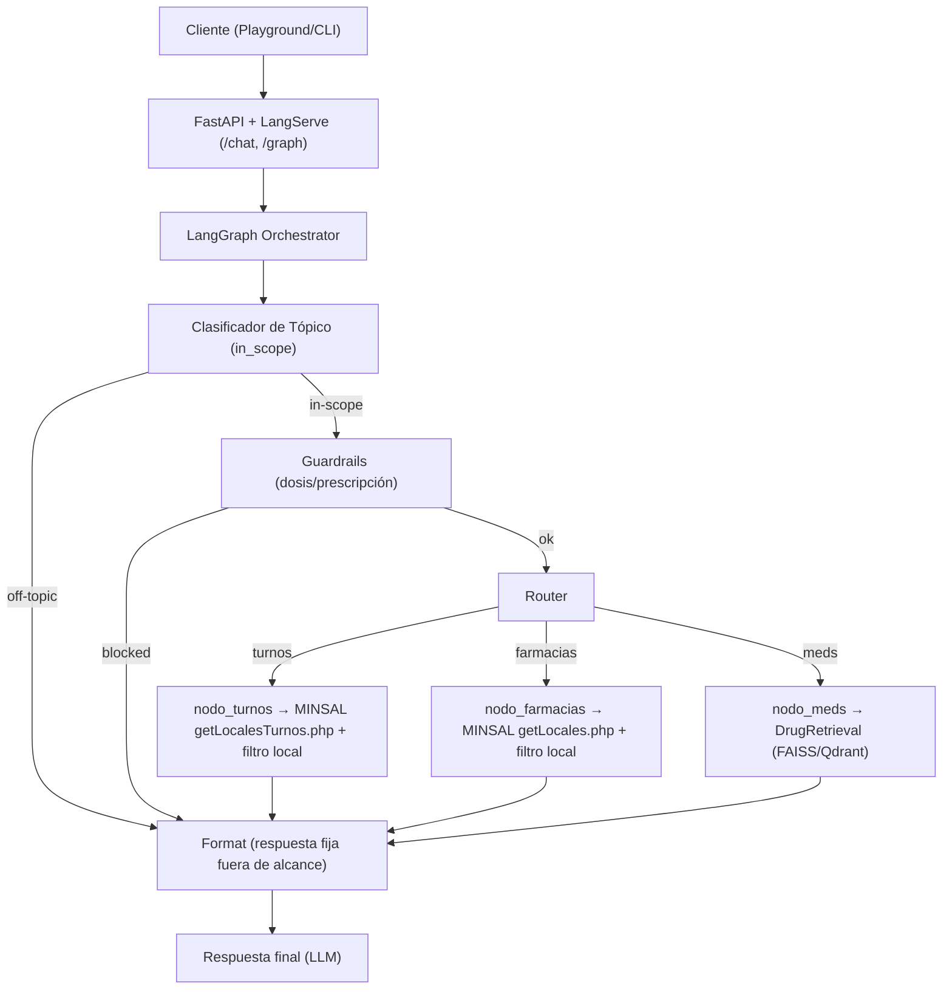
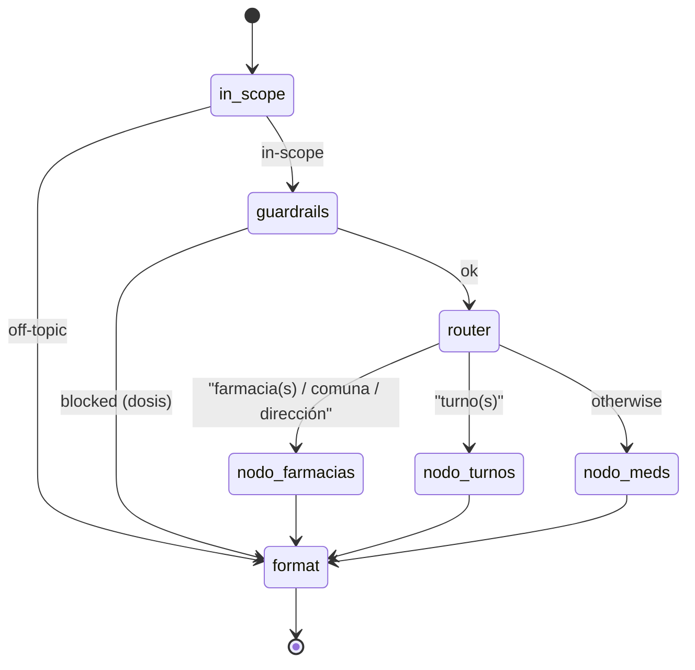
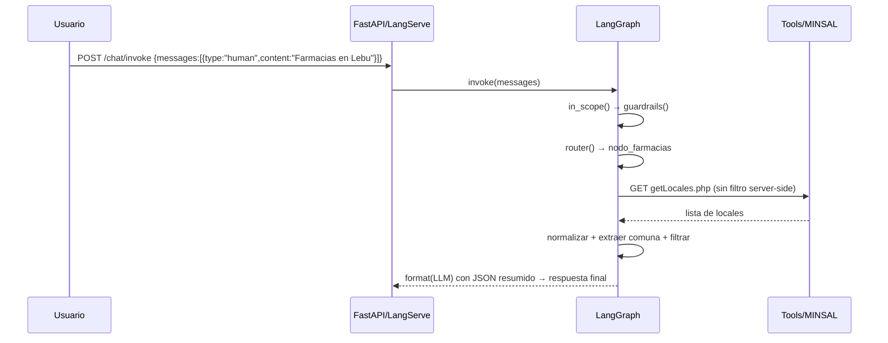

# 🩺 Agente MINSAL + Vademécum (LangGraph)

Este módulo implementa un agente que:
- Consulta farmacias (generales y de turno) desde las APIs públicas del MINSAL.
- Realiza búsqueda semántica sobre un CSV local de medicamentos (`DrugData.csv`).
- Orquesta el flujo con LangGraph (guardrails → router → tools → formato final), exponiendo la API con FastAPI + LangServe.

## 🚀 Inicio rápido

1) Activar entorno y dependencias
```bash
source /Users/pablolastrabachmann/DiploGenAI/venv_diplo/bin/activate
pip install -r /Users/pablolastrabachmann/DiploGenAI/final_proyect/requirements.txt
```

2) Variables de entorno (.env soportado)
- Obligatoria: `OPENAI_API_KEY` (también se acepta `openai_api_key` en minúsculas).
- Opcionales:
  - `DRUGS_CSV_PATH` (default: `final_proyect/drug_dataset/DrugData.csv`)
  - `MINSAL_GET_LOCALES` (default oficial)
  - `MINSAL_GET_TURNOS` (default oficial)
  - `INDEX_DIR` (default: `final_proyect/med_agent_index`)

3) Levantar servidor
```bash
uvicorn final_proyect.med_agent.server:app --host 0.0.0.0 --port 8000 --reload
```

4) Probar endpoints
- Documentación: `http://127.0.0.1:8000/docs`
- Playground LangServe: `http://127.0.0.1:8000/chat/playground/`

## 🌐 Despliegue en Fly (UI incluida)

1) Instala y loguéate en flyctl.

2) Desde `final_proyect/` despliega:
```
flyctl deploy
```

3) Revisa estado y URL:
```
flyctl status
```

4) Abre la URL del app de Fly. Te redirige a `/chat/playground/` (UI incluida por LangServe).

5) (Opcional) Configura `MINSAL_PROXY_URL` para que tu app consuma el propio proxy:
```
flyctl secrets set MINSAL_PROXY_URL="https://<tu-app>.fly.dev"
```

- Invocación REST (ojo con el esquema de mensajes):
```bash
curl -X POST http://127.0.0.1:8000/chat/invoke \
  -H 'Content-Type: application/json' \
  -d '{"input":{"messages":[{"type":"human","content":"Farmacias en Ñuñoa"}]}}'
```

---

## 🧭 Arquitectura (alto nivel)



- `server.py`: publica el grafo en `/chat` y `/graph`.
- `graph.py`: define nodos, aristas y decisiones.
- `tools.py`: tools HTTP contra MINSAL.
- `retrieval.py`: índice FAISS/Qdrant sobre `DrugData.csv` con `OpenAIEmbeddings`.

---

## 🧩 Diseño del grafo (LangGraph)



### Nodos clave
- **in_scope**: clasificador que determina si el mensaje es de farmacias/medicamentos (o saludo). Si es off-topic, devuelve respuesta fija sin ofrecer ayudas relacionadas al tema fuera de alcance.
- **guardrails_node**: bloquea solicitudes de prescripción/dosis. Si bloquea, produce respuesta de política.
- **router_node**: enruta según intención (`turnos`, `farmacias`, `meds`, `saludo`).
- **nodo_turnos**: llama a `getLocalesTurnos.php`, normaliza y aplica filtro local por comuna.
- **nodo_farmacias**: llama a `getLocales.php`, y aplica el mismo pipeline de normalización/filtros (incluye búsqueda por dirección).
- **nodo_meds**: usa `DrugRetrieval` (FAISS/Qdrant) para obtener top-k relevantes.
- **format_final**: compone mensaje final factual y, como salvaguarda, si detecta off-topic, responde con el rechazo fijo, garantizando consistencia también en `/chat/invoke`.

---

## 🔎 Cómo se extrae y filtra la comuna/dirección

```mermaid
flowchart LR
  A["Texto usuario"] --> B["lowercase"]
  B --> C["remove accents"]
  C --> D["remove punctuation"]
  D --> E["collapse spaces"]
  E --> F{Pattern?}
  F -->|"en …"| G["extract comuna"]
  F -->|"comuna de …"| G
  F -->|"farmacias de …"| G
  E --> H{Address? (digits/keywords)}
  H -->|sí| I["tokenizar dirección"]
  I --> J["match tokens en local_direccion"]
```

---

## 🌐 Cómo consulta a MINSAL y procesa resultados

- Llamadas HTTP (GET) vía `tools.py`:
  - `tool_minsal_locales` → `MINSAL_GET_LOCALES`
  - `tool_minsal_turnos` → `MINSAL_GET_TURNOS`
- Si el servidor no filtra por `comuna`, el agente descarga y filtra localmente (exacto → parcial; dirección si corresponde).
- El resultado filtrado se adjunta como `RESULTADOS_*` y `format` sintetiza la respuesta factual.



---

## 💊 Búsqueda semántica en CSV de medicamentos

- `retrieval.py` crea/carga un índice local (FAISS/Qdrant).
- Embeddings con `OpenAIEmbeddings`.
- Cada fila del CSV se transforma en `Document` combinando campos (Drug Name, Class, Indications, etc.).
- `nodo_meds` invoca `retriever.search(query, k=5~12)` y `format` compone una ficha factual.

---

## 🧪 Ejemplos de uso

- Farmacias en una comuna
```bash
curl -s -X POST http://127.0.0.1:8000/chat/invoke \
  -H 'Content-Type: application/json' \
  -d '{"input":{"messages":[{"type":"human","content":"me puedes listar las farmacias de lebu?"}]}}'
```

- Farmacias de turno
```bash
curl -s -X POST http://127.0.0.1:8000/chat/invoke \
  -H 'Content-Type: application/json' \
  -d '{"input":{"messages":[{"type":"human","content":"que farmacia hay de turno hoy en traiguen?"}]}}'
```

- Buscar por dirección
```bash
curl -s -X POST http://127.0.0.1:8000/chat/invoke \
  -H 'Content-Type: application/json' \
  -d '{"input":{"messages":[{"type":"human","content":"como se llama la farmacia que queda en Libertador Bernardo O\'Higgins 779?"}]}}'
```

- Información de medicamentos
```bash
curl -s -X POST http://127.0.0.1:8000/chat/invoke \
  -H 'Content-Type: application/json' \
  -d '{"input":{"messages":[{"type":"human","content":"efectos adversos del ibuprofeno"}]}}'
```

- Off-topic (receta) — rechazo fijo
```bash
curl -s -X POST http://127.0.0.1:8000/chat/invoke \
  -H 'Content-Type: application/json' \
  -d '{
    "input": {"messages": [{"type":"human","content":"¿me das una receta de lentejas?"}]},
    "config": {"configurable": {"session_id": "usuario_pruebas"}}
  }'
```
Respuesta: “Lo siento, pero no puedo proporcionar información sobre ese tema. Sin embargo, si necesitas información sobre farmacias o medicamentos, estaré encantado de ayudarte.”

---

## 🔒 Política de seguridad y tópico estricto

- Capa 1 (tópico): se acepta solo farmacias/turnos/meds (o saludo). Otros temas responden con el rechazo fijo.
- Capa 2 (dosis/prescripción): bloquea cualquier dosificación o prescripción con mensaje de política.
- El `format_final` incluye una salvaguarda para mantener la política incluso si se invoca directamente el runnable (`/chat/invoke`).

---

## 🛠️ Estructura de archivos
```
final_proyect/med_agent/
├── __init__.py
├── config.py           # Config y rutas
├── tools.py            # HTTP tools MINSAL
├── retrieval.py        # FAISS + embeddings sobre CSV
├── graph.py            # Grafo LangGraph (nodos y flujo)
├── server.py           # FastAPI + LangServe
└── README.md           # Este documento
```

---

## 🧰 Troubleshooting
- El playground muestra 500 si el JSON de entrada no usa `{type:"human"}` en cada mensaje.
- “Address already in use”: el puerto 8000 está ocupado. Liberar y reiniciar:
```bash
lsof -ti :8000 | xargs -r kill -9
uvicorn final_proyect.med_agent.server:app --host 0.0.0.0 --port 8000 --reload
```
- Clave OpenAI: asegúrate de tener `OPENAI_API_KEY` (o `openai_api_key`) cargada.
- Si MINSAL no filtra por comuna, el agente igual aplica filtrado local en memoria.
- Si off-topic no responde con el rechazo fijo, revisa que tu `graph.py` incluya `InScopeDecision` y la salvaguarda de `format_final`.

---

## 🗺️ Roadmap
- Métricas (latencia, tokens) y evaluación cuantitativa automática.
- Memoria conversacional en Redis (historial por usuario) enriquecida.
- Búsqueda por coordenadas (lat/lng + radio).
- NER geográfico para extraer ubicaciones más robustas.

---

## 📜 Licencia
Uso educativo en el marco del Diplomado. Ajustar según políticas del proyecto.
